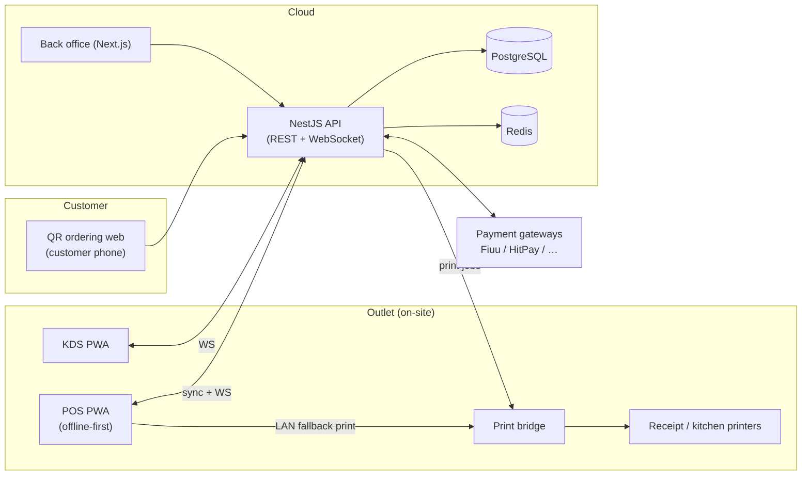

# Architecture

## Stack

| Layer | Choice | Why |
|-------|--------|-----|
| Language | TypeScript end-to-end | One language across POS, KDS, web, API; shared types prevent drift between client and server |
| Monorepo | pnpm workspaces | Shared packages (types, tax logic, DB schema) consumed by every app |
| API | NestJS (Fastify adapter) — modular monolith | One module per domain (orders, menu, payments, inventory, CRM, HR); enforced structure that survives the suite growing to 10+ modules; split into services later only if needed |
| Database | PostgreSQL + Prisma | Relational fits orders/inventory/payroll; Prisma gives typed queries + migrations. Single DB, multi-tenant via `companyId`/`outletId` on every row |
| Real-time | WebSocket gateway (Nest) | KDS order push, sold-out sync, QR order status, table state |
| Cache / pub-sub | Redis (phase 2+) | Fan-out across multiple API instances; in-process events until then |
| POS terminal | React PWA (Vite) | **Offline-first**: IndexedDB (Dexie) local store + outbox queue, syncs when online; installs to home screen on cheap Android tablets |
| KDS | React PWA (Vite) | Same offline shell; station-filtered order stream |
| QR ordering | Next.js | Customer-facing; SSR for instant menu load on slow phones; per-table session tokens |
| Back office | Next.js | Menu/inventory/HR/reports admin |
| Printing | Print-bridge agent (Node, on-site) | Talks ESC/POS over LAN/USB to receipt & kitchen printers; receives jobs from API/POS over local network |
| Payments | Adapter interface per gateway | Start: cash + one gateway covering MY+SG (Fiuu or HitPay → cards, DuitNow QR, PayNow); add Stripe/Adyen/iPay88 as adapters |
| Auth | Back office: email+password (JWT, RBAC). POS/KDS: device registration + staff PIN | Matches how F&B staff actually work — shared terminal, personal PIN |

## System diagram



## Monorepo layout

```
apps/
  api/         NestJS modular monolith
  pos/         POS terminal PWA (Vite + React)        [phase 1]
  kds/         Kitchen display PWA                     [phase 2]
  qr/          Customer QR ordering (Next.js)          [phase 2]
  backoffice/  Admin web (Next.js)                     [phase 1]
  print-bridge/ On-site ESC/POS agent                  [phase 1]
packages/
  shared/      Domain types, enums, money/tax/rounding logic (pure TS, no deps)
  db/          Prisma schema + generated client
```

## Core decisions

### Money
All amounts are **integer cents** (sen/cents), never floats. Currency per company (MYR/SGD).

### Tax & totals (in `packages/shared`, used by API *and* offline POS)
Order total pipeline: items → subtotal → service charge (e.g. 10%) → tax (MY SST 6%/8% or SG GST 9%, inclusive or exclusive) → **MY 5-sen cash rounding** (cash only) → total. One pure function, unit-tested, shared by client and server so offline receipts match server records.

### Offline-first sync (POS)
- POS keeps full working set locally: menu, tables, open orders, members.
- Every mutation is an **event appended to a local outbox** (UUIDv7 ids generated client-side), applied optimistically to the local store, then pushed when online.
- Server is authoritative; conflicts resolved server-side (last-writer-wins per field for menu-ish data; orders are append-only events so they merge cleanly).
- Payments while offline: cash always works; card/QR via terminal still works (terminal has its own line) with ref captured for later reconciliation.

### Multi-tenancy
`Company` → `Outlet` → everything. Every table carries `companyId` (and `outletId` where relevant); every query is scoped by middleware. One schema, one DB — simplest thing that works until a big franchise needs isolation.

### IDs
UUIDs generated client-side (offline creation) — `crypto.randomUUID()`. Human-facing numbers (order #, invoice #) are per-outlet daily sequences assigned on sync/server, with a provisional local number offline.

## Local development
No Docker on the dev machine yet. Options (in order):
1. Install Postgres.app (macOS) — real Postgres, zero config.
2. `prisma generate` / `prisma validate` work without a live DB, so schema work and codegen never block.
3. CI uses real Postgres in a service container.

## Build order (maps to FEATURES.md phasing)

1. **Phase 1 skeleton (now)**: monorepo, shared money/tax logic, Prisma schema for POS core, API with menu + orders + payments (cash), POS PWA with offline outbox, receipt printing, back office menu editor, Z report.
2. Phase 2: QR ordering + KDS + table management + WebSocket fan-out (Redis).
3. Phase 3: inventory/recipes/purchasing/consignment.
4. Phase 4: CRM/loyalty + e-invoicing (MyInvois, InvoiceNow).
5. Phase 5: HR/staffing/e-leave/payroll + aggregators + advanced analytics.
